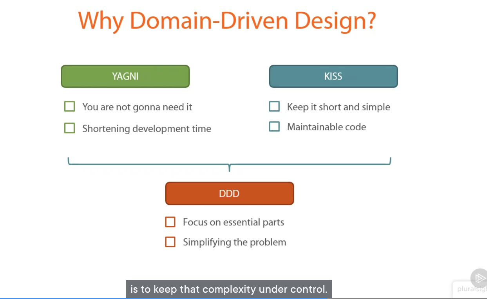
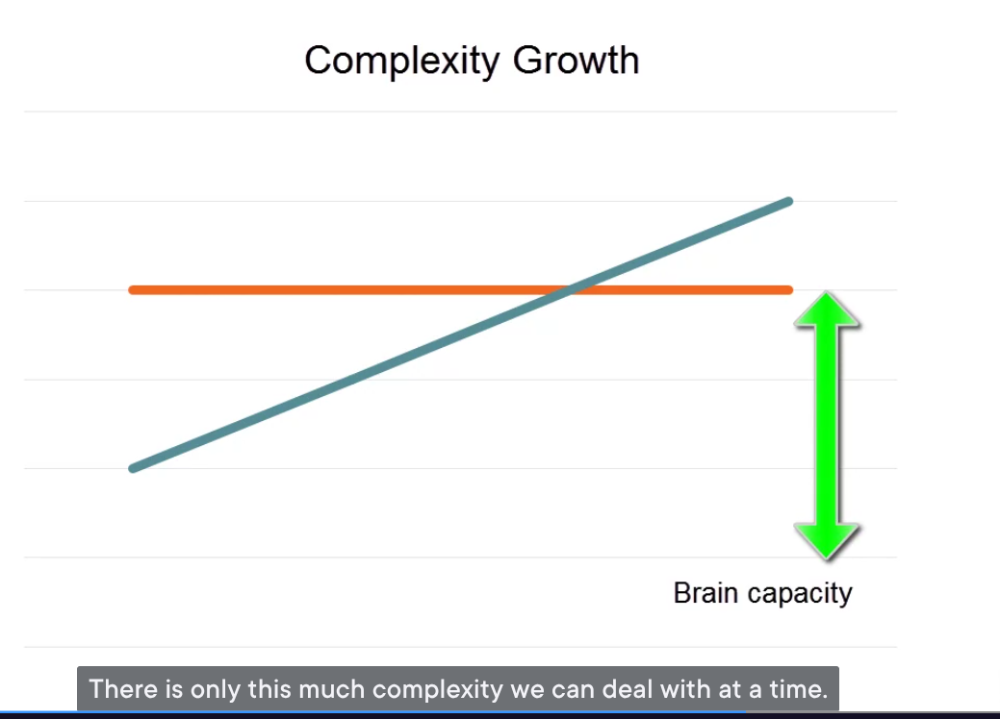
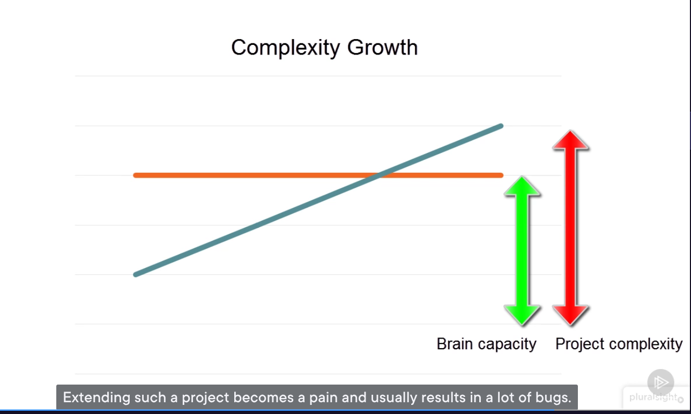
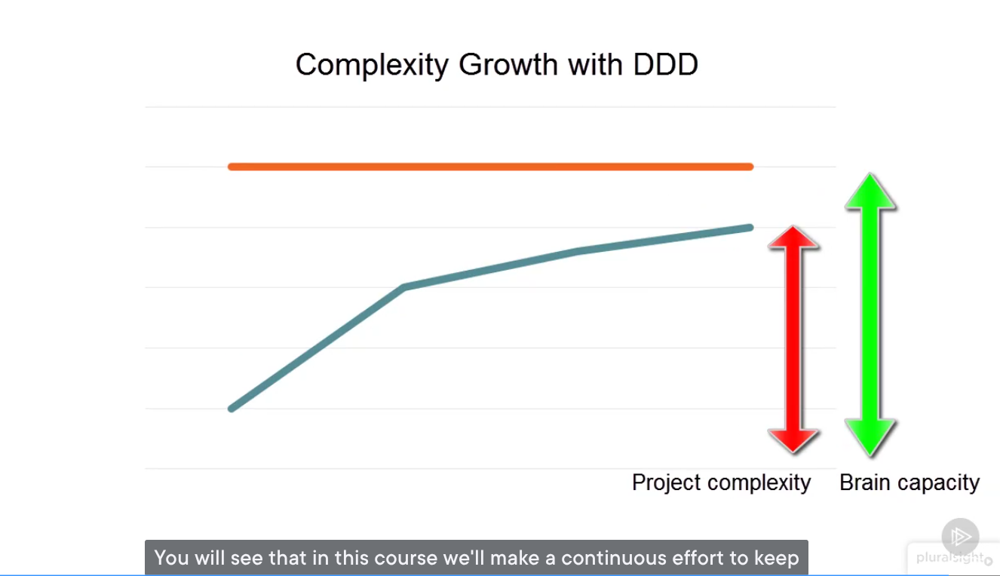

# 1.4 Why Domain-Driven Design?
*Duration: [Duration to be determined from course timing]*

## Overview
This chapter explores the fundamental reasons for adopting Domain-Driven Design, focusing on how DDD complements core software development principles and helps manage complexity in enterprise applications.

## Key Topics
- **YAGNI** (You Are Not Gonna Need It) principle
- **KISS** (Keep It Short and Simple) principle  
- How DDD complements fundamental development principles
- The complexity challenge in modern software development
- DDD as a solution for managing business logic complexity
- Why complexity control is critical for project success

## Learning Objectives
By the end of this chapter, you will understand:
- The two core principles every programmer should follow (YAGNI & KISS)
- How Domain-Driven Design enhances these fundamental principles
- Why uncontrolled complexity is the primary cause of project failure
- How DDD helps maintain code simplicity and expressiveness
- The specific value DDD provides for enterprise-level applications

## Visual Resources

The chapter includes four key diagrams that illustrate the relationship between fundamental software principles and Domain-Driven Design:

*YAGNI (You Are Not Gonna Need It) - Demonstrates why implementing only current needs prevents waste and over-engineering*

  
*KISS (Keep It Short and Simple) - Shows how simple implementations lead to readable, maintainable code*

*Illustrates how YAGNI and KISS work together as the foundation of effective software development*

*Visualizes how Domain-Driven Design enhances and complements the YAGNI and KISS principles*

**💡 Reading Tip**: These images are integrated throughout the [complete transcript](transcript-full.md) with contextual explanations to help you follow the concepts visually as you read.

## Content Structure

### 📝 Available Materials
- **README.md** - This overview and navigation (current file)
- **[transcript-full.md](transcript-full.md)** - Complete formatted transcript with detailed explanations
- **[key-points.md](key-points.md)** - Interview-ready bullet-point summary
- **images/** - Visual diagrams illustrating principles (4 images)

### 🎯 Quick Access
- **For detailed study**: [Read the complete transcript](transcript-full.md)
- **For interview prep**: [Review key bullet points](key-points.md)
- **For visual learning**: Study the diagrams above

## Key Insights

### The Core Message
> **DDD's beauty lies in how it complements YAGNI and KISS principles by providing structure to manage business complexity while keeping code simple and maintainable.**

### Critical Understanding
- **Complexity control** is the most difficult task in modern business software
- **Uncontrolled complexity growth** is one of the biggest reasons software projects fail
- **DDD prevents complexity spiral** by focusing on clear business logic expression

## Navigation
- [Previous: Area of Application for DDD](../1.3-area-of-application/README.md)
- [Next: Chapter 1.5](../1.5-next-chapter/README.md) *(if applicable)*
- [Back to Section 1: Introduction](../README.md)
- [Back to Course Overview](../../README.md)

---

**✅ Content Status**: Complete - All materials processed and organized