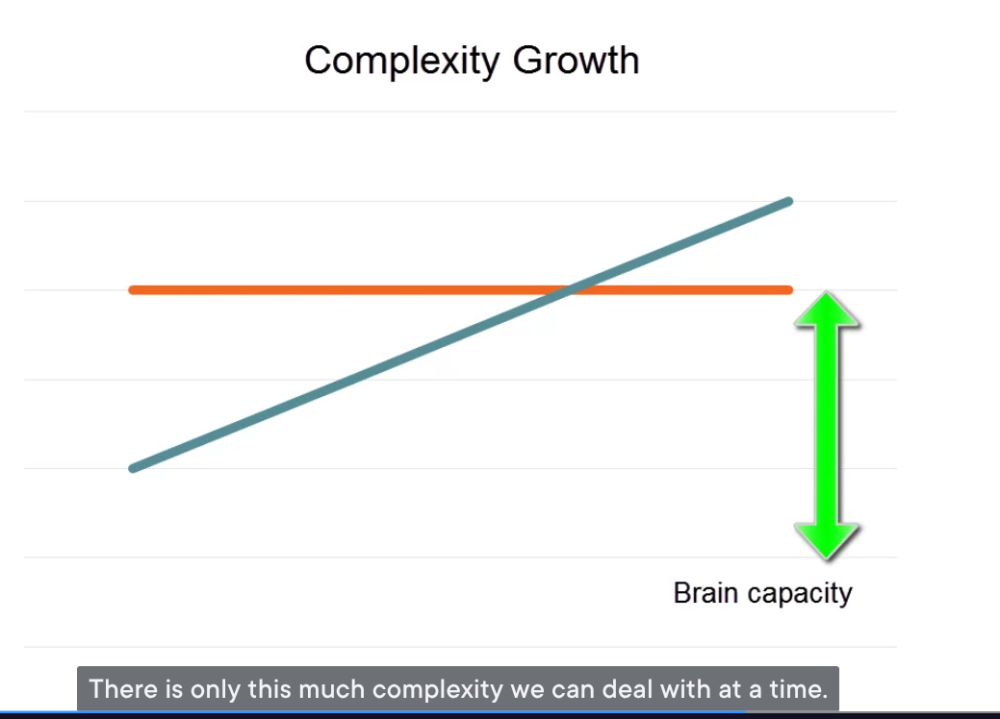
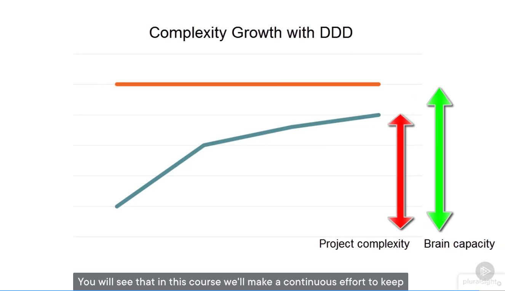

# 1.4 Why Domain-Driven Design? - Complete Transcript

## Setting the Groundwork: Core Principles

Let's set some groundwork and talk about the basic principles we will follow in this course. In my opinion, there are two core principles in software development to which every programmer should adhere in most cases. They are **YAGNI** and **KISS**.

### YAGNI - You Are Not Gonna Need It

The first principle we need to understand is YAGNI, which provides crucial guidance on what functionality to implement and when.

*YAGNI (You Are Not Gonna Need It) - The principle that guides us to implement only current requirements*

**YAGNI** stands for "You Are Not Gonna Need It," and basically means you should implement only the functionality you need in this particular moment. You shouldn't try to anticipate the future needs, because most of the functionality you develop "just in case" turns out to be unused and thus, just a waste of time.

As illustrated in the diagram above, YAGNI helps us focus on present requirements rather than speculative future needs. This prevents over-engineering and keeps development efficient.

### KISS - Keep It Short and Simple

The second fundamental principle complements YAGNI by focusing on how we implement the functionality we do choose to build.

*KISS (Keep It Short and Simple) - The principle that guides us toward simplest possible implementations*

**KISS** stands for "Keep It Short and Simple." This principle is about making the implementation of the remaining functionality as simple as possible. The point here is that the simpler your code is, the more readable, and thus more maintainable it becomes.

The visual above demonstrates how KISS principle drives us toward clarity and simplicity in our code implementations, making them easier to understand and maintain over time.

### The Two Fundamental Principles Working Together

When we combine YAGNI and KISS, we get a powerful framework for software development decision-making.

*The two fundamental principles every programmer should follow - YAGNI and KISS working in harmony*

This diagram illustrates how these two principles work together to create a solid foundation for software development. YAGNI determines WHAT to build, while KISS determines HOW to build it.

### Why These Principles Matter

These principles are important because they help solve two major problems we face when building software projects:

1. **Shortening the time needed for development** (YAGNI prevents unnecessary work)
2. **Keeping the code base maintainable in the long run** (KISS ensures clarity)

### How Domain-Driven Design Complements These Principles

Now we come to the crucial connection: how does Domain-Driven Design fit with these fundamental principles?

*How Domain-Driven Design complements and enhances YAGNI and KISS principles*

The beauty of Domain-Driven Design is that its practices complement these two software development principles. As shown in the diagram, DDD allows us to:

- **Extract the central part of the problem domain**
- **Simplify it, removing most of the unnecessary complexity**
- **Express business logic in the clearest way possible**

This ability to express business logic in the clearest way possible is a single trait that makes Domain-Driven Design so appealing in enterprise-level applications.

The visual representation above shows how DDD acts as a bridge between these core principles and real-world business complexity, providing structure without sacrificing simplicity.

### The Complexity Problem

It is hard to estimate how important that is. **The most difficult task in modern business line software is to keep that complexity under control.**

#### The Human Limitation

There is only so much complexity we can deal with at a time. If the code exceeds it, it becomes really hard, and at some point, even impossible, to change anything in the software without introducing some unexpected side effects.

#### The Consequences of Uncontrolled Complexity

- **Extending such a project becomes a pain**
- **Usually results in a lot of bugs**
- **This, in turn, slows the development down**
- **May eventually lead to failure of the project**

**Uncontrollable growth of complexity is one of the biggest reasons why software projects fail.**

### How Domain-Driven Design Helps

Domain-Driven Design helps prevent this complexity spiral. You will see that in this course we'll make a continuous effort to keep our code base as simple and as expressive as possible.

By following DDD practices while adhering to YAGNI and KISS principles, we create a powerful combination that:
- Focuses on essential business functionality (YAGNI)
- Implements it in the simplest way possible (KISS)  
- Structures it for clarity and maintainability (DDD)

### Key Takeaways

1. **YAGNI and KISS** are fundamental principles for successful software development
2. **DDD complements these principles** by providing structure for managing complexity
3. **Business logic clarity** is crucial for enterprise applications
4. **Complexity control** is the most difficult challenge in modern software development
5. **Uncontrolled complexity** is a primary cause of project failure
6. **DDD provides tools** to maintain simplicity and expressiveness throughout development

---

*This chapter establishes the philosophical foundation for why Domain-Driven Design is valuable, showing how it aligns with and enhances fundamental software development principles through visual and conceptual integration.*