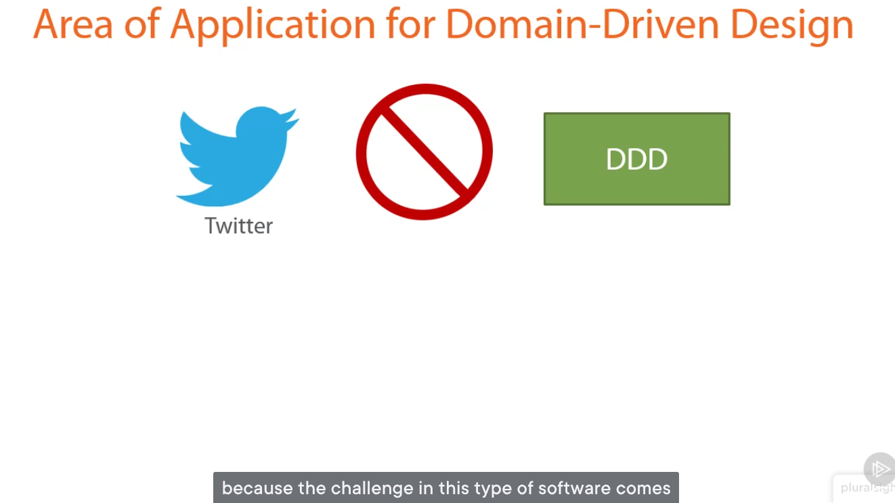

[domain-driven-design-in-practice](https://app.pluralsight.com/library/courses/domain-driven-design-in-practice)  

Every Software haas a set of attributes

- Set of Attributes
    -   Amount of data
    -   Performance
    -   Business logic complexity
    -   Technical complexity

Here’s a concise, interview-ready summary of the key points about **when and why to use Domain-Driven Design (DDD)**:

---

### **When to Use DDD (and When Not To)**

**DDD is valuable *only* when:**
- The project has **high business logic complexity** (e.g., enterprise systems like ERP, insurance, banking, or logistics platforms).
- The core challenge is **modeling intricate domain rules, workflows, and relationships**—not performance, scale, or infrastructure.

**DDD is *not* suitable for:**
- **Big data** or **high-throughput systems** (e.g., analytics platforms, data pipelines) — the bottleneck is data volume, not domain logic.
- **High-performance systems** with strict latency requirements (e.g., trading platforms, real-time gaming) — optimization and infrastructure dominate.
- **CRUD or simple applications** (e.g., basic admin panels, blogs, or even social apps like Twitter) — business rules are minimal; scalability is the real challenge.
- **Technically complex but domain-simple systems** (e.g., embedded systems, OS-level tools) — complexity lies in hardware/algorithms, not business concepts.

### **Core Purpose of DDD**
- **Tackle business complexity** by creating a **ubiquitous language** and **rich domain models**.
- Improve **maintainability**, **extensibility**, and **team alignment** in long-lived enterprise applications.
- **Not a performance, scalability, or infrastructure solution**.

> 💡 **Interview Tip**: Emphasize that DDD is a *strategic design approach for complex domains*, not a universal best practice. Choosing it depends on **where the project’s real complexity lies**.

--- 

This summary shows you understand **context-driven architecture decisions**—a strong signal of senior-level thinking.